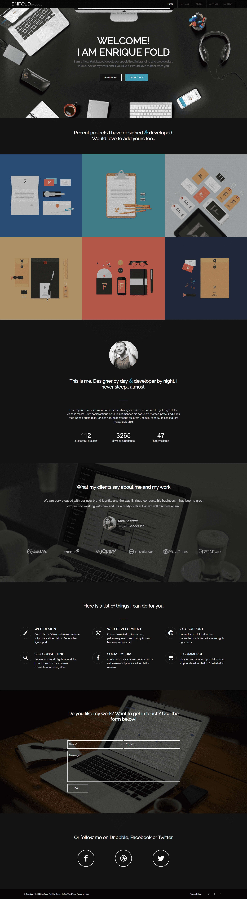

# Portfolio

## Url
https://portfoliojs2023.netlify.app/

### About
This is the first project that I presented at the end of my training course. A one-page website has an interesting banner that attracts the audience and then uses a small gallery to display the portfolio and then gives a description about the person. Finally, you can contact the owner of the portfolio using a form that also has a social network. No other libraries or packages were used to create this website. It was originally a WordPress theme that I customized.